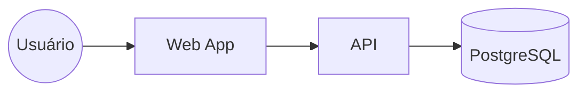

# Portfolio — Architecture Docs (ADRs • C4 • RFCs)

Documentação de arquitetura **sênior-friendly** para portfólio e times: reúne **ADRs** (Architecture Decision Records), **RFCs** (propostas de mudança) e **diagramas C4** em um site estático com **Docusaurus**.

> Objetivo: demonstrar **maturidade arquitetural**, decisão com contexto e rastreabilidade, além de visualização clara da solução (C4). Ideal para **entrevistas**, **onboarding** e **governança técnica**.

---

## Sobre

> “Este repositório consolida ADRs, RFCs e C4 em um site Docusaurus. Tenho scripts para criar ADR/RFC com numeração e data, e CI que publica no GitHub Pages. É meu hub de decisões e visão arquitetural — dá para ver como eu penso, justifico e comunico mudanças.”

---

## Intuito / Para que serve

- **Centralizar decisões e propostas** com histórico (ADRs/RFCs).
- **Visualizar a arquitetura** em diferentes níveis (C4: Context, Containers, Components, Code).
- **Publicar** em GitHub Pages para facilitar o consumo por recrutadores e stakeholders.
- **Automatizar** a criação de ADR/RFC com scripts (numeração + data).
- **Reutilizar** como template em outros projetos.

**Público-alvo:** você (portfólio), engenheiros do time, tech leads, produto/segurança e quem precisar entender *por que* a arquitetura é assim.

---

## Stack & Ferramentas

- **Docusaurus (TypeScript)** — site de documentação.
- **Mermaid** — diagramas simples in-docs.
- **Structurizr DSL** (opcional) — modelagem C4 com export para imagens.
- **Scripts Node** (`new:adr`, `new:rfc`) — geradores de arquivos numerados.
- **GitHub Actions** — deploy automático em **GitHub Pages**.

---

## O que tem aqui

- **ADRs** (`/docs/adrs/*`): decisões arquiteturais (Contexto → Decisão → Consequências).
- **RFCs** (`/docs/rfcs/*`): propostas com motivação, design, impactos e plano de rollout.
- **C4** (`/c4/workspace.dsl` + `/static/img/c4/*`): visão por níveis com export de imagens.
- **Site** (`/docs` + Docusaurus): navegação e busca.

---

## Estrutura do repositório

```
portfolio-architecture-docs/
├─ docusaurus.config.ts           # config do site (Pages, tema, i18n)
├─ sidebars.ts                    # navegação da docs
├─ package.json                   # scripts (start/build/deploy/new:adr/new:rfc)
├─ docs/
│  ├─ index.md                    # landing
│  ├─ architecture/overview.md    # visão geral + links C4
│  ├─ adrs/                       # ADRs numeradas (ADR-0001-*.md)
│  └─ rfcs/                       # RFCs numeradas (RFC-0001-*.md)
├─ c4/
│  ├─ workspace.dsl               # modelo C4 (Structurizr DSL)
│  └─ README.md                   # como exportar para imagens
├─ static/img/c4/                 # PNG/SVG exportados do C4
├─ scripts/
│  ├─ new-adr.mjs                 # cria ADR numerada com data
│  └─ new-rfc.mjs                 # cria RFC numerada com data
└─ .github/workflows/deploy.yml   # CI para GitHub Pages (opcional)
```

---

## Como usar

### 1) Instalação

Use **pnpm** (recomendado) ou **yarn** (se preferir).

**pnpm**
```bash
pnpm install
```

**yarn**
```bash
yarn
```

### 2) Desenvolvimento local

**pnpm**
```bash
pnpm start
```
**yarn**
```bash
yarn start
```

Abre o servidor local (hot reload).

### 3) Build

**pnpm**
```bash
pnpm build
```
**yarn**
```bash
yarn build
```

Gera estáticos em `build/`.

---

## Scripts de automação (ADRs / RFCs)

Cria um arquivo numerado com data em `docs/adrs` ou `docs/rfcs`.

**pnpm**
```bash
pnpm new:adr "Escolha de NestJS no backend"
pnpm new:rfc "Padronização de observabilidade"
```

**yarn** (chame o Node diretamente):
```bash
node scripts/new-adr.mjs "Escolha de NestJS no backend"
node scripts/new-rfc.mjs "Padronização de observabilidade"
```

> Caso use pnpm e veja “Command not found”, garanta que os scripts estão no `package.json`:
> ```json
> {
>   "scripts": {
>     "new:adr": "node scripts/new-adr.mjs",
>     "new:rfc": "node scripts/new-rfc.mjs"
>   }
> }
> ```

**Convenções**  
- ADRs: `ADR-0001-minha-decisão.md` (Status, Contexto, Decisão, Consequências, Alternativas).
- RFCs: `RFC-0001-minha-proposta.md` (Sumário, Motivação, Design, Impactos, Plano).
- Uma RFC aprovada geralmente dá origem a uma ADR **Accepted**.

---

## Diagramas C4 (duas opções)

### A) Mermaid (rápido, no próprio Markdown)

```md

```

### B) Structurizr DSL (foco em modelagem)

1) Modele em `/c4/workspace.dsl` (exemplo incluído).  
2) Exporte para PlantUML:
```bash
docker run --rm -v "$PWD":/wrk -w /wrk structurizr/cli:latest \
  export -workspace c4/workspace.dsl -format plantuml -output c4/out
```
3) Gere PNGs:
```bash
docker run --rm -v "$PWD/c4/out":/in -v "$PWD/static/img/c4":/out plantuml/plantuml \
  -tpng -o /out /in/*.puml
```
4) Referencie nas docs:
```md

```

---

## Deploy (GitHub Pages)

### CI recomendado (Actions)
- Workflow em `.github/workflows/deploy.yml` faz build e publica.
- Em **Settings → Pages** escolha **GitHub Actions**.

### Deploy manual (alternativa)

**SSH**
```bash
USE_SSH=true pnpm deploy
# ou
USE_SSH=true yarn deploy
```

**HTTPS**
```bash
GIT_USER=<seu-usuario> pnpm deploy
# ou
GIT_USER=<seu-usuario> yarn deploy
```

> Se empurrar workflows por HTTPS e receber erro de permissão (`workflow`), troque o remoto para **SSH**:
> `git remote set-url origin git@github.com:<user>/<repo>.git`  
> …ou atualize o token via `gh auth refresh -h github.com -s repo -s workflow && gh auth setup-git`.

---

## Quando escrever ADR vs RFC?

- **RFC**: quando há **proposta** a ser discutida (“deveríamos adotar Kafka?”).  
- **ADR**: quando a **decisão** foi tomada (“adotaremos Kafka por X/Y/Z”).  
- Uma RFC aprovada geralmente dá origem a uma ADR **Accepted**.
